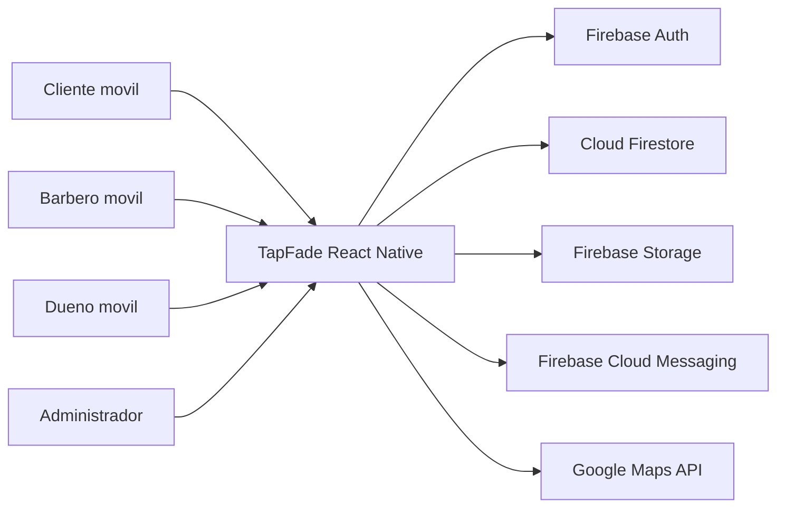

# Arquitectura inicial

## Decision base

La primera version se construira con:

- Frontend movil: React Native.
- Opcion recomendada de arranque: Expo.
- Backend: Firebase.
- Autenticacion: Firebase Auth, Google Sign-In, Apple Sign-In y correo.
- Base de datos: Cloud Firestore.
- Archivos: Firebase Storage.
- Notificaciones: Firebase Cloud Messaging.
- Mapas: Google Maps API.
- CI/CD: GitHub Actions.

## Vista general

## Criterios tecnicos iniciales

- Separar modulos por dominio de negocio.
- Mantener componentes compartidos en `shared`.
- Evitar logica de negocio dentro de componentes visuales.
- Centralizar acceso a Firebase.
- Usar validaciones consistentes por modulo.
- Mantener reglas de seguridad de Firestore alineadas a roles.

## Riesgos a vigilar

- Dependencia de Firebase y servicios de Google.
- No-shows sin penalizacion.
- Baja adopcion por parte de barberias.
- Rechazo en tiendas por privacidad o uso incorrecto de permisos.
- Crecimiento de datos sin reglas claras de retencion.

