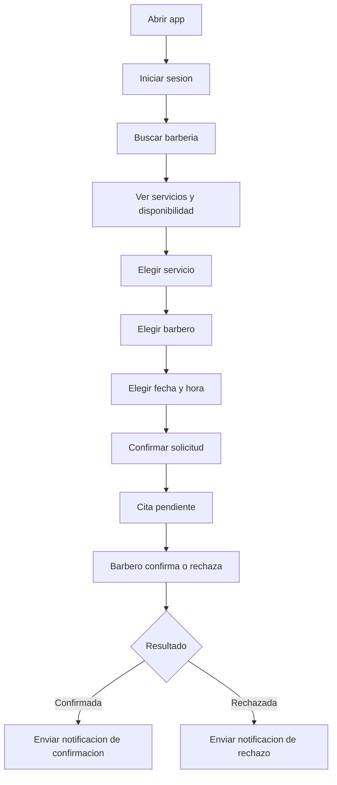
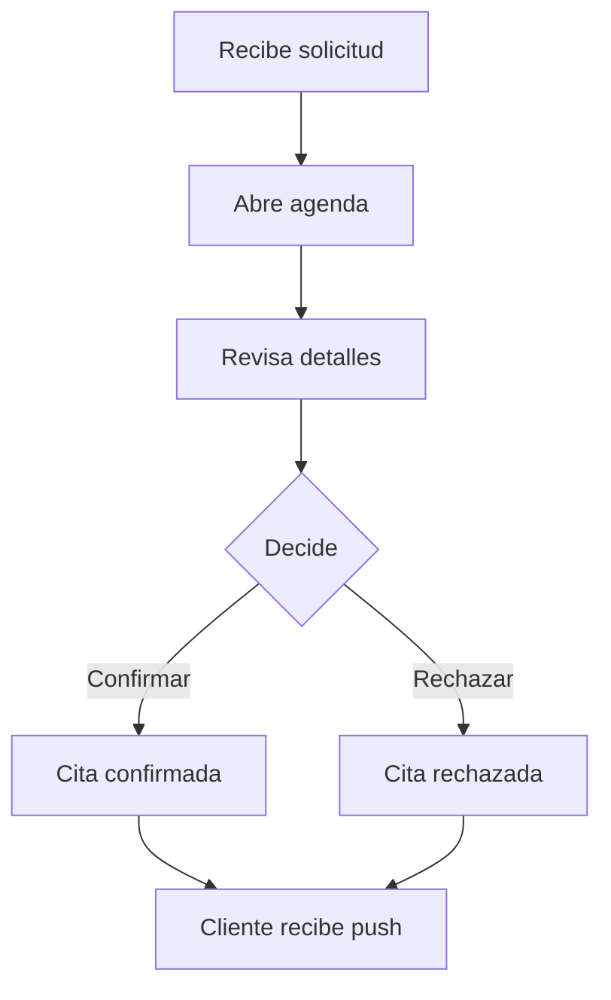
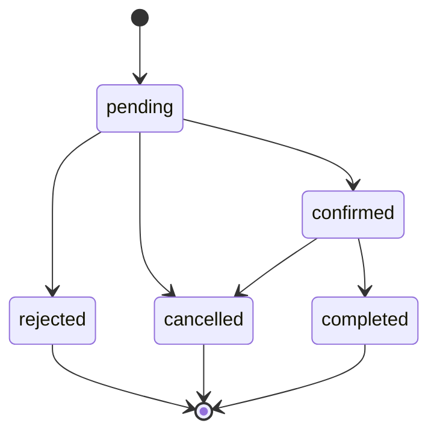
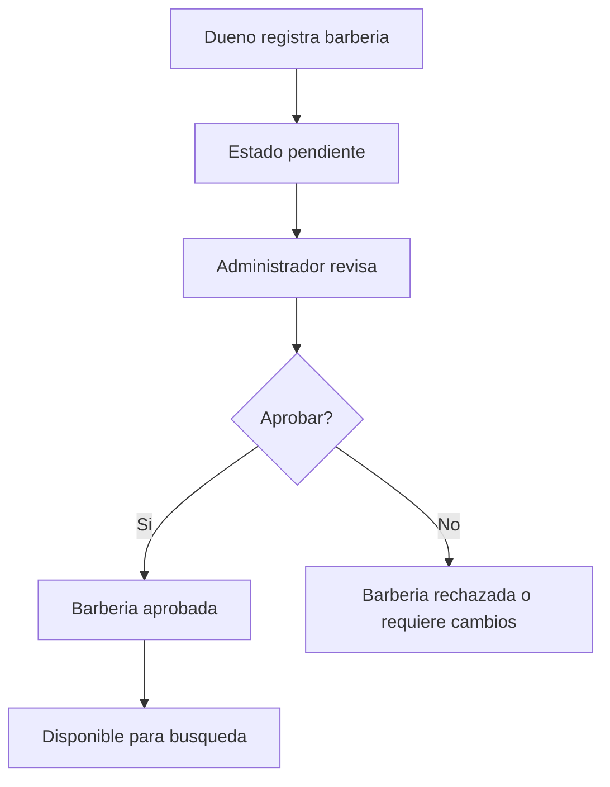

# Diagramas de flujo principales

## Flujo cliente: agendar cita

```mermaid
flowchart TD
  A["Abrir app"] --> B["Iniciar sesion"]
  B --> C["Buscar barberia"]
  C --> D["Ver servicios y disponibilidad"]
  D --> E["Elegir servicio"]
  E --> F["Elegir barbero"]
  F --> G["Elegir fecha y hora"]
  G --> H["Confirmar solicitud"]
  H --> I["Cita pendiente"]
  I --> J["Barbero confirma o rechaza"]
  J --> K{"Resultado"}
  K -->|Confirmada| L["Enviar notificacion de confirmacion"]
  K -->|Rechazada| M["Enviar notificacion de rechazo"]
```

## Flujo barbero: confirmar cita

```mermaid
flowchart TD
  A["Recibe solicitud"] --> B["Abre agenda"]
  B --> C["Revisa detalles"]
  C --> D{"Decide"}
  D -->|Confirmar| E["Cita confirmada"]
  D -->|Rechazar| F["Cita rechazada"]
  E --> G["Cliente recibe push"]
  F --> G
```

## Estados de una cita

```mermaid
stateDiagram-v2
  [*] --> pending
  pending --> confirmed
  pending --> rejected
  pending --> cancelled
  confirmed --> completed
  confirmed --> cancelled
  rejected --> [*]
  cancelled --> [*]
  completed --> [*]
```

## Alta de barberia

```mermaid
flowchart TD
  A["Dueno registra barberia"] --> B["Estado pendiente"]
  B --> C["Administrador revisa"]
  C --> D{"Aprobar?"}
  D -->|Si| E["Barberia aprobada"]
  D -->|No| F["Barberia rechazada o requiere cambios"]
  E --> G["Disponible para busqueda"]
```

